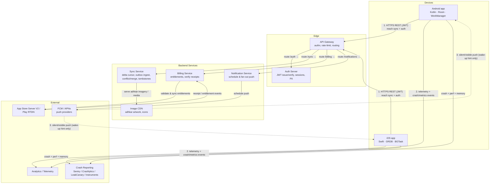

# Athkar — System Context, Container (C4 L1) & Component (C4 L2) Diagrams

Mermaid `graph TD` diagrams. The C4-style level one (containers) and level two (components) below
use the canonical Mermaid `graph TD` block form so they render in GitHub / VS Code / Mermaid Live
without extra plugins.

---

## Level 1 — Container diagram (`graph TD`)

Shows the mobile apps, the backend edge (API gateway, auth server, push), and external systems
(App Store Server V2 / Play Real-Time Developer Notifications, image CDN, analytics, crash
reporting). Key flows are annotated with `-.->` dashed edges and labeled arrows.



**Key flows**
1. **Online read/sync** — apps authenticate via the gateway, then pull deltas from the Sync Service
   and push outbox entries.
2. **Telemetry & crash** — apps emit analytics and crash/perf/memory data to out-of-band sinks.
3. **Push as wake-up hint** — push is a best-effort nudge to sync; correctness never depends on it.

---

## Level 2 — Component diagram (Android focus, `graph TD`)

Shows the internal sub-components of the client (presentation / domain / data / sync layers), the
SQLite-in-WAL DB, the outbox, the Keystore-secured credentials, and the remote gateways. Annotated
with the < 16 ms read and reactive-Flow edges central to ADR-03.

```mermaid
graph TD
    subgraph Presentation
        SCR[Screens<br/>State + sealed Intent]
        VM[ViewModel / Reducer<br/>immutable State, logs transitions]
    end

    subgraph Domain
        UC[UseCases]
        CORE[Core: Hlc · Lww/LwwMap ·<br/>EntityConflictResolver · UuidV7]
        SYNC_POL[SyncPolicy: Backoff · Tombstone ·<br/>ReplicaState · CursorLogic]
    end

    subgraph Data
        REPO[Repositories (implements Domain interfaces)]
        ROOM[Room / GRDB DAO<br/>reactive Flow exposes local state]
        OUTBOX[Outbox writer<br/>idempotency key = UUIDv7]
        NET[Network drivers<br/>REST + Delta page decode]
        SEC[Keystore / Keychain<br/>auth + encryption keys]
    end

    subgraph Storage
        DB[(SQLite · WAL<br/>single source of truth)]
        TOMB[tombstones · retention 90 d]
        CURSOR[sync_cursor · single row]
    end

    subgraph Remote
        GW2[API Gateway]
        SYNC2[Sync Service]
        AUTH2[Auth Server]
        NOTIF2[Notification Service]
        FCM2[FCM / APNs]
    end

    SCR -- "read local reactive Flow (p95 < 16 ms)" --> ROOM
    SCR -- "emit sealed Intent" --> VM
    VM --> UC
    UC --> CORE
    UC --> SYNC_POL
    UC -- "mutate via repository" --> REPO
    REPO --> ROOM
    ROOM -- "read/write rows" --> DB
    ROOM -- "tombstone housekeeping" --> TOMB
    ROOM -- "persist cursor" --> CURSOR

    UC -- "enqueue op (UUIDv7 key)" --> OUTBOX
    OUTBOX -- "persist" --> DB
    NET -- "read outbox → send idempotent RPC" --> OUTBOX
    NET -- "verify/refresh token" --> SEC
    SEC --> AUTH2
    NET -- "HTTPS (JWT)" --> GW2
    GW2 --> SYNC2
    NET -- "subscribe for wake-up" --> NOTIF2
    NOTIF2 --> FCM2
    FCM2 -. "wake-up hint" .-> SCR
```

---

## Level 2 — Component diagram (iOS focus, `graph TD`)

Analog of the Android component diagram for the Swift (GRDB, BGTask, Keychain, URLSession) client.

```mermaid
graph TD
    subgraph iOS Presentation
        V[SwiftUI Views<br/>State + sealed Action]
        STORE[Store / Reducer<br/>immutable State, os_log transitions]
    end

    subgraph iOS Domain
        UC2[UseCases]
        CORE2[Core: Hlc · Lww ·<br/>ConflictResolver · UUIDv7 (shared)]
        SYNC_POL2[SyncPolicy: Backoff ·<br/>Tombstone · ReplicaState · CursorLogic]
    end

    subgraph iOS Data
        REPO2[Repositories]
        GRDB[GRDB Database<br/>ValueObservation reactive reads]
        OUTBOX2[Outbox writer<br/>idempotency key = UUIDv7]
        NET2[URLSession drivers<br/>REST + Delta page decode]
        KEYCHAIN[Keychain<br/>auth + encryption keys]
    end

    subgraph iOS Storage
        DB2[(GRDB SQLite · WAL<br/>source of truth)]
        TOMB2[tombstones · retention 90 d]
        CURSOR2[sync_cursor · single row]
    end

    V -- "read GRDB observation (p95 < 16 ms)" --> GRDB
    V -- "emit sealed Action" --> STORE
    STORE --> UC2
    UC2 --> CORE2
    UC2 --> SYNC_POL2
    UC2 --> REPO2
    REPO2 --> GRDB
    GRDB -- "read/write" --> DB2
    GRDB --> TOMB2
    GRDB --> CURSOR2
    UC2 -- "enqueue op" --> OUTBOX2
    OUTBOX2 -- "persist" --> DB2
    NET2 --> OUTBOX2
    NET2 --> KEYCHAIN
    NET2 -- "HTTPS (JWT)" --> GW2
    NET2 --> NOTIF2
    NOTIF2 --> FCM2
    FCM2 -. "wake-up hint" .-> V
```
