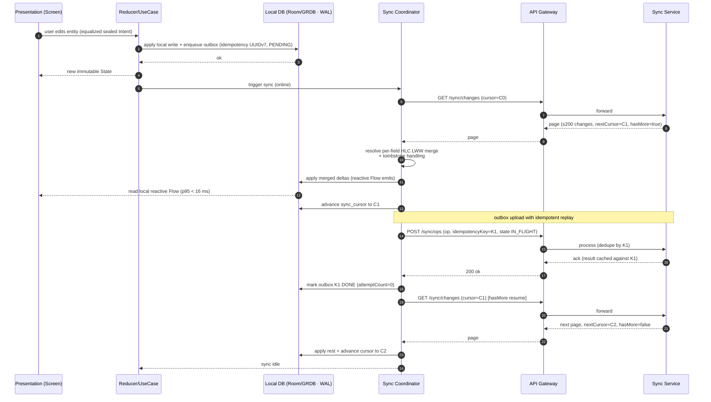
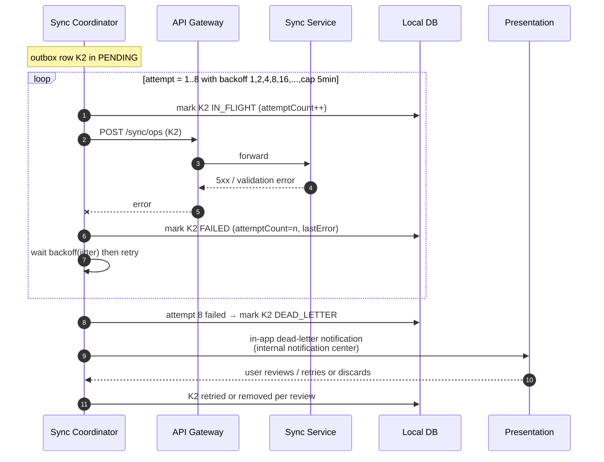
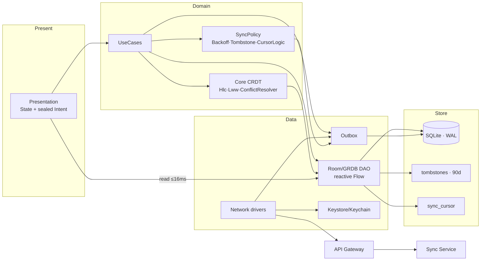

# Athkar — Sync Cycle: Sequence, Component & State-Machine Diagrams

Mermaid diagrams covering the **full sync cycle**: the happy path, three distinct failure paths
(network drop mid-page, permanent failure → dead letter, conflict resolution / manual merge), plus
a component view and the sync-coordinator state machine.

All diagrams are `sequenceDiagram`, `graph`, or `stateDiagram-v2` in fenced Mermaid blocks and
render in GitHub / VS Code / Mermaid Live.

---

## 1. Happy-path sync cycle (`sequenceDiagram`)

A full cycle: pull deltas, apply/merge locally, push pending outbox ops, advance the cursor.
Includes the idempotency-key replay guarantee and the < 16 ms reactive read back into the UI.



**Correctness notes:** the local write is applied immediately (offline-first) and only later
reconciled. Cursor advancement takes the **max** server HLC, so re-applying a page is idempotent.
The outbox operation carries `K1 = UUIDv7`, so any replay returns the cached result.

---

## 2. Failure path A — Network drop mid-page (`sequenceDiagram`)

The client disconnects while paging `hasMore=true`. It must **resume from the last decoded page**,
never restart from the beginning, and retry with backoff.

```mermaid
sequenceDiagram
    autonumber
    participant SYNC as Sync Coordinator
    participant GW as API Gateway
    participant SVR as Sync Service
    participant DB as Local DB

    SYNC->>GW: GET /sync/changes (cursor=C0)
    GW->>SVR: forward
    SVR-->>GW: page3 changes, nextCursor=C1, hasMore=true
    GW-->>SYNC: page (decoded & applied)
    SYNC->>DB: apply decode(page) + set cursor=C1 (durable)

    SYNC->>GW: GET /sync/changes (cursor=C1)  [next page]
    Note over SYNC,GW: network drops mid-request
    GW--xSYNC: connection lost / timeout

    SYNC->>SYNC: commit last decoded page; DO NOT reset cursor
    SYNC->>SYNC: schedule retry: backoff 1s (full jitter)

    Note over SYNC,GW: reconnect
    SYNC->>GW: GET /sync/changes (cursor=C1)  [resume, not restart]
    GW->>SVR: forward
    SVR-->>GW: page4, nextCursor=C2, hasMore=false
    GW-->>SYNC: ok
    SYNC->>DB: apply + advance cursor to C2

    Note over SYNC: no duplicate / no lost change:
    Note over SYNC: resume from last *decoded* page only.
```

**Key invariant:** the cursor is never advanced past a page that wasn't fully decoded and committed.
A mid-page drop advances to the last fully-applied page's cursor and continues from there — making
the sync tolerant of arbitrarily many interruptions without loss or duplication.

---

## 3. Failure path B — Permanent failure → dead letter (`sequenceDiagram`)

An outbox op keeps failing (e.g. 500s, invalid payload, server rejection). Backoff escalates
1→2→4→8→16 s, cap 5 min, 8 attempts, then the row moves to `DEAD_LETTER` and the user is notified.



**Policy (from `SyncPolicy.kt`/`Outbox.kt`):** `OutboxPolicy.onFailure` returns `FAILED` while
`backoff.canRetry()` is true, else `DEAD_LETTER`. Dead-letter rows are surfaced via the notification
center and can be manually retried or discarded. No automated retry occurs on a dead-lettered row.

---

## 4. Failure path C — Conflict resolution / manual merge (`sequenceDiagram`)

Two devices edit the same entity **offline** on different fields (and one edits a sensitive field).
Automatic per-field HLC LWW handles the non-sensitive fields; a sensitive field forces a manual merge.

```mermaid
sequenceDiagram
    autonumber
    participant D1 as Device A (user)
    participant D2 as Device B (offline)
    participant DB1 as Local DB A
    participant SVR as Sync Service

    D1->>D1: offline edit title @ HLC t1 (w1)
    D2->>D2: offline edit body @ HLC t2 (w2) + edit sensitive-field @ t3
    Note over D1,SVR: both still offline

    D1->>SVR: sync (outbox push + pull)
    SVR->>SVR: idempotency per op; server issues HLC for ordering
    D2->>SVR: sync later
    SVR->>SVR: per-field LWW merge (title:t1, body:t2) → converges
    Note over SVR: sensitive field @ t3 vs later server write -> no auto-merge

    SVR-->>D1: delta with MANUAL_MERGE_REQUIRED for sensitive field
    D1->>D1: show both versions side by side (left/right)
    D1->>SVR: user picks resolved value (new HLC, w1)
    SVR-->>D1: converged snapshot
    SVR-->>D2: merged snapshot (title+body+resolved sensitive)

    Note over D1,D2: both replicas now converge on identical entity
```

**Guarantees (verified by `ConflictResolverPropertyTest.kt` / `CrdtMapPropertyTest.kt`):**
merge is associative/commutative/idempotent; the final state is identical on all replicas regardless
of delivery order; tombstone defeats all so a deleted record is never resurrected.

---

## 5. Component diagram (`graph`)

Overview of the client-side components cooperating to run a sync cycle.



---

## 6. Sync coordinator — state machine (`stateDiagram-v2`)

The coordinator's lifecycle, mapping directly onto `OutboxState` (`Outbox.kt`) and the backoff /
cursor logic.

```mermaid
stateDiagram-v2
    [*] --> IDLE

    IDLE --> PULLING: online / refresh / push wake-up
    PULLING --> MERGING: page decoded (≤200)
    PULLING --> PULLING: canRetry & backoff (1..8/5min cap)<br/>mid-page drop → resume from last decoded
    MERGING --> PUSHING: apply deltas + advance cursor
    PUSHING --> IDLE: all outbox entries DONE

    state PUSHING {
        [*] --> OUT_PENDING
        OUT_PENDING --> OUT_IN_FLIGHT: send (idempotency UUIDv7)
        OUT_IN_FLIGHT --> OUT_DONE: 2xx ack
        OUT_IN_FLIGHT --> OUT_FAILED: transient error
        OUT_FAILED --> OUT_IN_FLIGHT: retry (backoff canRetry)
        OUT_FAILED --> OUT_DEAD_LETTER: 8 attempts exhausted
    end

    PUSHING --> CONFLICT: manual merge required
    CONFLICT --> PUSHING: user resolved (new HLC)

    OUT_DEAD_LETTER --> IDLE: user reviews / discards
```

**Notes on the diagram:**
- `PULLING → PULLING` is the mid-page retry loop with exponential backoff (1/2/4/8/16 s … cap 5 min,
  max 8 attempts) from **Failure path A**.
- `OUT_FAILED → OUT_DEAD_LETTER` is **Failure path B**; the dead-letter row is surfaced and only the
  user (or an explicit review trigger) moves it on.
- `PUSHING → CONFLICT → PUSHING` is **Failure path C**; the coordinator suspends the push of the
  affected op until the human resolves the manual merge with a fresh HLC.
